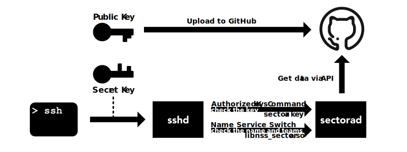

# Sectora

**Sector A**uthentication

(formerly named as **ghteam-auth**)

Using this program, you can grant login privileges on your servers to GitHub team members or outside collaborators of your repository.

Implemented with Rust.

[](https://circleci.com/gh/yasuyuky/sectora)
[](https://github.com/yasuyuky/sectora/actions)

# How it works



# How to use

1. Generate the ssh key pair and [upload the public key to GitHub](https://help.github.com/en/github/authenticating-to-github/adding-a-new-ssh-key-to-your-github-account)

2. Use [the deb file](https://github.com/yasuyuky/sectora/releases) to setup sectora to the server

   - You need a developer token with the following scope
     - read:org
     - repo (optional)

3. Log in to the server with your private key

# Manual Setup

## How to build manually

See [Makefile](https://github.com/yasuyuky/sectora/blob/master/Makefile) for details

## How to install and setup manually

1. Copy executable and shared object to each path
2. Put config file for this program
3. Register sectora daemon to systemd and enable it
4. Configure name service switch
5. Configure sshd
6. Configure PAM (Optional)

[A setting example of ansible is available](https://github.com/yasuyuky/sectora/blob/master/ansible/)

### Copy the executable file and shared object to each path

#### Copy executable file

Put `sectora` & `sectorad` to `/usr/sbin/`.

#### Copy shared object

Put `libnss_sectora.so` to `/usr/lib/`.

#### Create link of shared object

`ln -s /usr/lib/libnss_sectora.so /usr/lib/libnss_sectora.so.2`

### Put config file for this program

The minimal setting is like as follows.

```toml
token = "YOUR_PERSONAL_TOKEN_STRING"
org = "YOUR_ORGANIZATION"

[[team]]
name = "YOUR_TEAM1"
gid = 2019  # gid for YOUR_TEAM1

[[team]]
name = "YOUR_TEAM2"
gid = 2020  # gid for YOUR_TEAM2
group = "YOUR_GROUP_NAME"

[[repo]]
name = "YOUR_REPO_NAME"
```

See `struct Config` on `structs.rs` for details.

### Register sectora daemon to systemd

Put `/etc/systemd/system/sectora.service`

```
[Unit]
Description=Sectora Daemon
After=network.target

[Service]
ExecStart=/usr/sbin/sectorad
Restart=always
StandardOutput=journal
StandardError=journal

[Install]
WantedBy=multi-user.target
```

then execute `systemctl enable sectora && systemctl start sectora`

### Configure name service switch

Add the following lines to `/etc/nsswitch.conf`

```
passwd: files sectora
shadow: files sectora
group:  files sectora
```

### Configure sshd

Add the following lines to `/etc/ssh/sshd_config`.

```
AuthorizedKeysCommandUser root
AuthorizedKeysCommand /usr/sbin/sectora key %u
UsePAM yes
```

#### In the case of old sshd

In the case of old sshd, you need to create the following shell script and put it in your PATH.

```sectora.sh
#!/bin/bash
/usr/sbin/sectora key $1
```

Also, sshd_config should look like this.

```
AuthorizedKeysCommandUser root
AuthorizedKeysCommand /usr/sbin/sectora.sh
UsePAM yes
```

### Configure PAM (Optional)

Add the following lines to `/etc/pam.d/sshd`.

```
account requisite pam_exec.so quiet /usr/sbin/sectora pam
auth optional pam_unix.so not_set_pass use_first_pass nodelay
session required pam_mkhomedir.so skel: /etc/skel/ umask: 0022
```

Also, comment out the following line.

```
# @include common-auth
```

## Personal settings

To set personal settings, use `$HOME/.config/sectora.toml` like this.

```toml
sh = "/path/to/login/shell"
pass = "PASSWORD_HASH_STRING"
```

Use `mkpasswd` command to create your `PASSWORD_HASH_STRING`

```
mkpasswd -S $(head -c 4 /dev/urandom|xxd -p) -m sha-512
```

## LICENSE

MIT

## Special thanks

This program is inspired by [Octopass](https://github.com/linyows/octopass).
Thank you.
